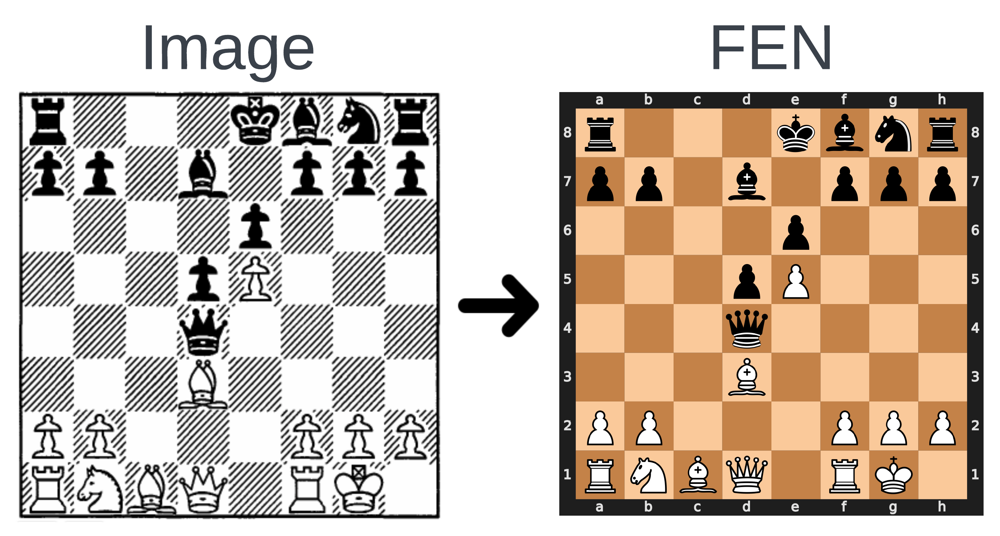
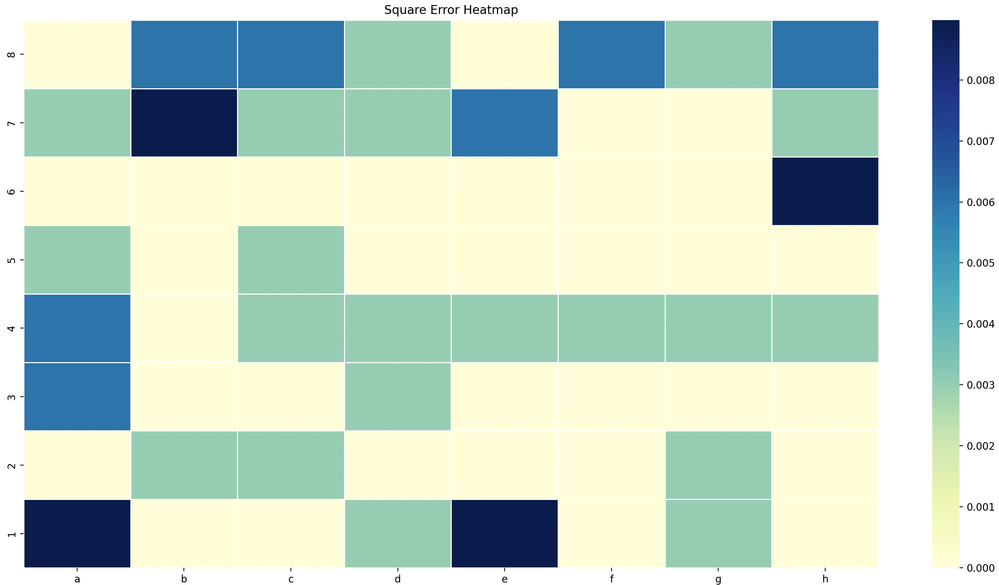
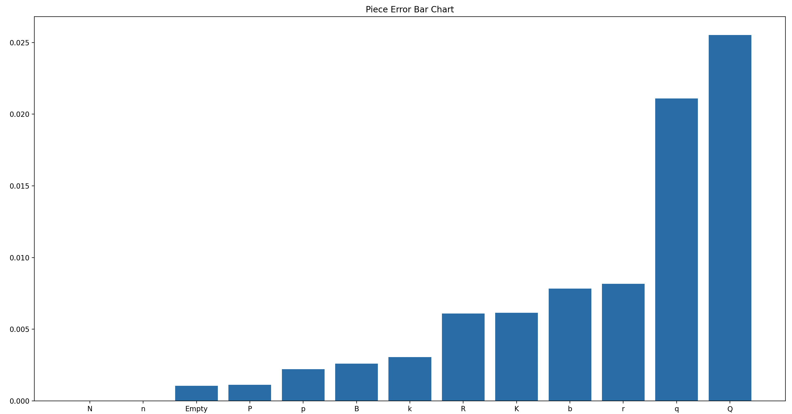
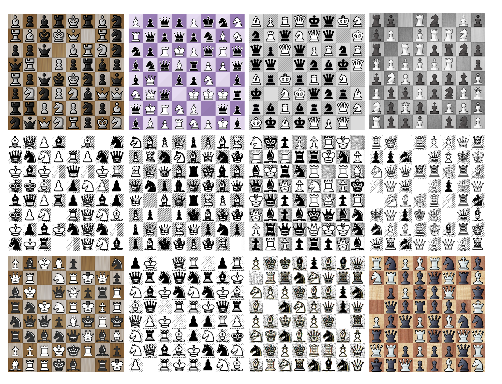

# fenify
Fenify is a project that uses AI / ML / deep learning to convert images of chess boards into their FEN (Forsyth-Edwards Notation) string. 

## Table of Contents

1. [Introduction](#introduction)
2. [Accuracy](#accuracy)
3. [Training](#training)
4. [Inference](#inference)
4. [Limitations](#limitations)

## Introduction

Forsyth-Edwards Notation (FEN) is a standard notation for describing a particular board position of a chess game. The purpose of FEN is to provide all the necessary information to restart a game from a particular position.  

Fenify is designed to take an image of a chess board and output the FEN string representing the board's current state. This can be useful for quickly setting up games to specific positions, analyzing gameplay, and more.

Fenify is particularlly targeting images from chess books on which other open source solutions can under perform. 

## Accuracy

Fenify is very accurate with a 99.8% per square accuracy on the test set.  The examples below were randomly selected and all perfect.  The charts show results across the entire test set. 

## Training

Previous open source board detection models, such as [Tensorflow Chessbot](https://github.com/Elucidation/tensorflow_chessbot), preprocess the board by dividing it into 64 squares and classifying each square separately.  Fenify avoids this preprocessing and predicts all 64 squares directly from the model.  While harder to train due, this methodology eleminates run time dependencies that fail on some poorly scanned chess books.  

Fenify is trained in two stages.  First it is trained on generated data from the `scripts/dataset_gen.py` output.  The generated data avoids class imbalance and gameplay bias by having an equal probability of each piece type (or empty) for each square.  Secondly the model is fine-tuned on a portion of boards taken directly from chess books.

Training code can be found in `training.ipynb` which was exported from Google Colab.  It requires small modifications to run because generated images and test set images were stored on my personal GCP account.  The test set isn't included in this repo because it is taken from personal scans of copyrighted materials.   

## Inference

Model weights are available in Github Releases.  Example code for running inference can be found in `scripts/inference.py`.  An example image can be found in `assets/example.png`.

## Limitations

Fenify has several known limitations
- No localization (finding the board within an image)
- No move detection (common on online boards with highlighted squares)
- No board orientation detection (assumes bottom left hand squares is A1)